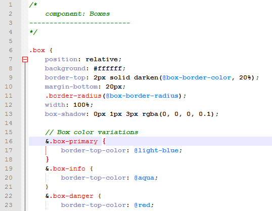

LESS for Notepad++
=========================

Syntax Highlighting for LESS files in Notepad++ (UDL v2.1.0.12)

What's This Thing
--------------
Just an xml file that gives you syntax highlighting/coloring for .LESS files inside recent versions of [Notepad++](http://notepad-plus-plus.org) (the ones that support the [User Defined Language](http://udl20.weebly.com/ "User Defined Language")).

What's new?
--------------
This is a fork from azrafe7's work (see [https://github.com/azrafe7/LESS-for-Notepad-plusplus] (https://github.com/azrafe7/LESS-for-Notepad-plusplus))
I've changed the color scheme in order to be closer to Notepad++'s original CSS scheme, and tinkered with the settings a bit. (ex. added folding in code)

How to Use it
--------------
 - Download the `less.xml` file
 - Open Notepad++
 - Go to  `Language -> Define your language...`,  click on  `Import...` and select the `less.xml` file you've downloaded
 - Close and restart Notepad++
 - Done

Notes
-------
Changing the background color should be quite easy, either by using Notepad++'s interface or by editing the xml file directly.

Here's a preview of how it looks like:

Thanks to *Raúl Salitrero* who made the initial version (see [http://sourceforge.net/apps/mediawiki/notepad-plus/?title=User_Defined_Language_Files#L](http://sourceforge.net/apps/mediawiki/notepad-plus/?title=User_Defined_Language_Files#L)).

Use it however you like it. 

Cheers,
zemigpt